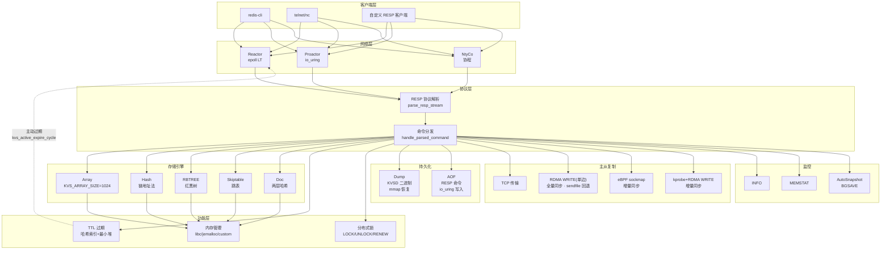
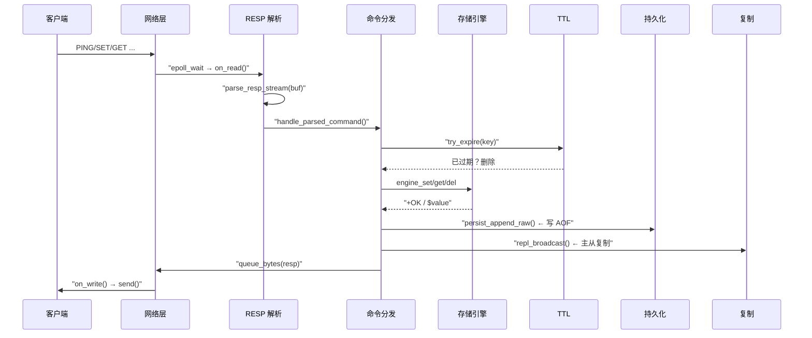

# kvstore — 高性能键值存储系统

[](LICENSE)
[](https://en.wikipedia.org/wiki/C_(programming_language))
[]()
[]()
[]()
[]()

kvstore 是一个用 **C 语言** 实现的类 Redis 键值存储系统，面向学习和研究。

**多存储引擎 · 多网络模型 · 多内存后端 · 持久化 · 主从复制 · 文档型 Value · TTL · RDMA · eBPF**

</div>

---

## 目录

- [快速开始](#快速开始)
- [项目结构](#项目结构)
- [核心能力](#核心能力)
- [命令参考](#命令参考)
- [配置说明](#配置说明)
- [文档索引](#文档索引)
- [实现原理](#实现原理)
- [测试体系](#测试体系)
- [测试产物路径](#测试产物路径)
- [性能基准](#性能基准)
- [开发指南](#开发指南)
- [常见问题](#常见问题)
- [许可证](#许可证)

---

## 快速开始

### 环境依赖

```bash
# Ubuntu/Debian
sudo apt install gcc make liburing-dev libjemalloc-dev

# RDMA 支持（可选）
sudo apt install librdmacm-dev libibverbs-dev

# RDMA 设备配置（Soft-iWARP）
# 加载内核模块并创建 RDMA 设备（使用本机物理网卡，如 ens33）
# 注意: 只创建 siw0，不要创建 rxe0 —— rxe0+siw0 同绑 ens33 会破坏跨机 RDMA（rdma_accept 失败回退 TCP）
# 双机已有 /usr/local/bin/setup-rdma.sh 处理（只建 siw0、删除残留 rxe0）
sudo modprobe siw
sudo rdma link add siw0 type siw netdev ens33
# 验证
rdma link show
# 输出应包含:
#   link siw0/1 state ACTIVE physical_state LINK_UP netdev ens33

# eBPF 支持（可选，需 ENABLE_EBPF=1）
sudo apt install libbpf-dev libelf-dev clang
```

### 编译

```bash
git clone --recurse-submodules <repo-url>
make clean && make        # 根 Makefile 委派到 kvstore/；或 cd kvstore && make clean && make
```

> 引擎在 `kvstore/` 子目录。编译产物：`kvstore/kvstore`（单可执行文件）。编译选项见 `kvstore/Makefile` 顶部 `ENABLE_RDMA`、`ENABLE_EBPF` 开关。

### 启动（主从复制）

> **权限说明**: eBPF+tcp 增量同步需加载 client_capture BPF（`fexit/tcp_recvmsg`），必须用 `sudo` 启动 Master。
> Slave 不需要 BPF，无需 `sudo`。BPF 加载失败时自动降级为纯 TCP 同步。
> 二进制和默认配置都在 `kvstore/` 下，先 `cd kvstore`（`kvstore.conf` 的 dump/aof 相对路径依赖 CWD）。

```bash
cd kvstore

# ── RDMA 全量 + eBPF+tcp 增量（推荐，需 root 启动 Master）──
sudo ./kvstore kvstore.conf --role master    # Master（需 root 加载 BPF）
./kvstore kvstore.conf --role slave          # Slave（无需 root）

# ── 纯 TCP 模式（无需 root）──
./kvstore kvstore.conf --role master --repl-fullsync-transport tcp --repl-realtime-transport tcp
./kvstore kvstore.conf --role slave  --repl-fullsync-transport tcp --repl-realtime-transport tcp

# ── 本地两实例测试（换端口避免与默认 5160 冲突，用 TCP）──
./kvstore kvstore.conf --role master --port 6380 \
  --repl-fullsync-transport tcp --repl-realtime-transport tcp &
./kvstore kvstore.conf --role slave  --port 6381 \
  --master-host 127.0.0.1 --master-port 6380 \
  --repl-fullsync-transport tcp --repl-realtime-transport tcp &

# ── 命令行覆盖单个选项 ──
./kvstore --config kvstore.conf --port 6380 --mem jemalloc
```

> ⚠️ **端口**：`kvstore/kvstore.conf` 默认 `port=5160`。测主从复制时建议换用其他端口（如 6380/6381）。

### 快速验证

```bash
# 启动 Master 后，用 nc 测试基本读写
printf '*3\r\n$3\r\nSET\r\n$3\r\nkey\r\n$5\r\nvalue\r\n' | nc 127.0.0.1 5160
printf '*2\r\n$3\r\nGET\r\n$3\r\nkey\r\n' | nc 127.0.0.1 5160
```

或使用 Redis 客户端（如 `redis-cli`）直接连接 5160 端口。

---

## 项目结构

```
pocket-kv/
├── kvstore/                      # 引擎（代码主体）
│   ├── src/                      # 核心 C 源码
│   │   ├── main/kvstore.c        #   入口、RESP 协议、命令分发
│   │   ├── core/                 #   网络模型 (reactor / proactor / ntyco)
│   │   ├── storage/              #   存储引擎 (array / hash / rbtree / skiptable / doc / vector)
│   │   ├── memory/kvs_mem.c      #   内存后端 (libc / jemalloc / custom)
│   │   ├── expire/kvs_expire.c   #   TTL 过期管理
│   │   ├── persistence/kvs_persist.c  # 持久化 (dump + AOF)
│   │   ├── replication/          #   主从复制、RDMA、eBPF、哨兵（含 bpf/ 子目录）
│   │   ├── ebpf_proxy/           #   独立 ebpf-proxy 进程（增量转发，fexit 捕获）
│   │   └── utils/hash.c          #   哈希工具
│   ├── include/kvstore/          # 公共头文件
│   ├── NtyCo/                    # 协程库 (git submodule)
│   ├── third_party/libbpf/       # 预编译 libbpf（ebpf-proxy 链接用）
│   ├── tools/                    # 测试 & 辅助脚本
│   │   ├── bench/                #   性能基准脚本
│   │   ├── persist/              #   持久化验证脚本
│   │   ├── repl/                 #   复制验证脚本 (TCP/RDMA/eBPF)
│   │   ├── rdma/                 #   RDMA 探测脚本
│   │   ├── ebpf/                 #   eBPF 独立守护进程
│   │   └── tests/                #   通用测试辅助脚本
│   ├── tests/                    # 测试代码
│   │   ├── integration/          #   集成测试 shell 脚本
│   │   ├── perf/                 #   性能测试 C 程序（独立 Makefile.perf）
│   │   ├── unit/                 #   单元测试目录（预留，仅 .gitkeep）
│   │   └── test_*.c              #   C 测试程序
│   ├── testdata/                 # 静态测试数据（样例配置）
│   ├── benchmarks/               # 基准结果与图表（本地留存，不入库）
│   ├── assets/diagrams/          # 架构图 / 流程图
│   ├── clients/                  # 多语言客户端示例 (Go/Java/JS/Python/Rust)
│   ├── docs/                     # 文档中心
│   │   ├── tech-roadmap.md       #   技术路线与实现详解 ← 新手必读
│   │   ├── data_analysis/        #   基准数据分析
│   │   ├── optimization-history/ #   优化历程
│   │   ├── use/                  #   实现详解与 QA
│   │   └── examples/             #   API 使用示例
│   ├── kvstore.conf              # 默认配置
│   ├── kvstore-ebpf.conf         # eBPF 守护进程配置
│   ├── vmlinux.h                 # BPF 编译用内核类型（由 BTF 生成）
│   └── Makefile                  # 构建入口
├── README.md
├── LICENSE
└── Makefile                      # 委派到 kvstore/
```

> `artifacts/` 为测试运行时产物目录，由脚本按需创建，已在 `.gitignore` 中；`kvstore/benchmarks/` 同样只保留在本地，不随仓库分发。

---

## 核心能力

### 存储引擎


| 引擎      | 前缀   | 说明                       |
| --------- | ------ | -------------------------- |
| Array     | 无前缀 | 基础数组存储，适合小数据量 |
| Hash      | `H*`   | 哈希表，适合大量 key 场景  |
| RBTREE    | `R*`   | 红黑树，有序存储           |
| Skiptable | `X*`   | 跳表，适合范围查询         |

> 例：`HSET key value` 使用哈希引擎，`RSET key value` 使用红黑树引擎。

### 网络模型


| 模型     | 底层     | 适用场景   |
| -------- | -------- | ---------- |
| Reactor  | epoll    | I/O 密集型 |
| Proactor | io_uring | 高并发异步 |
| NtyCo    | 协程     | 海量连接   |

### 功能矩阵


| 功能                         | 状态      | 说明                                                                                           |
| ---------------------------- | --------- | ---------------------------------------------------------------------------------------------- |
| RESP 协议                    | ✅ 完成   | 完整解析与响应                                                                                 |
| 全量持久化 (dump)            | ✅ 完成   | 二进制`KVSD` 格式，优先 mmap 恢复                                                              |
| 增量持久化 (AOF)             | ✅ 完成   | RESP 命令格式，优先 io_uring 写入                                                              |
| SAVE / BGSAVE / BGREWRITEAOF | ✅ 完成   | 支持同步/异步持久化                                                                            |
| 主从复制                     | ✅ 完成   | FULLRESYNC + partial resync + backlog                                                          |
| RDMA 全量同步                | ✅ 完成   | 全量数据通过 RDMA 传输，与 eBPF 实时同步可同时启用                                             |
| eBPF sockmap 实时同步        | ✅ 完成   | 内核态转发路径，**非默认回退方案**（`ebpf_enabled=0`，kprobe 不可用时启用）                    |
| kprobe+RDMA 增量同步         | ✅ 完成   | 可选路径（`repl_realtime_transport=kprobe-rdma`），已标记 legacy                               |
| eBPF+tcp 增量同步            | ✅ 完成   | **推荐（默认）**：ebpf-proxy 独立进程 fentry 捕获 `tcp_recvmsg` → ringbuf → TCP 转发到 slave |
| TTL / 过期                   | ✅ 完成   | 哈希索引 + 最小堆调度                                                                          |
| 文档型 value                 | ✅ 完成   | DOCSET/DOCGET 等 7 个命令                                                                      |
| 分布式锁                     | ✅ 完成   | LOCK/UNLOCK/RENEW/OWNER                                                                        |
| 哨兵模式                     | ⚠️ 基础 | 框架已有，自动故障转移待完善                                                                   |
| 自动快照                     | ✅ 完成   | 按时间+变化数规则触发                                                                          |

---

## 命令参考

### 基本键值


| 命令                      | 说明                       |
| ------------------------- | -------------------------- |
| `SET key value`           | 设置键值                   |
| `GET key`                 | 获取键值                   |
| `DEL key`                 | 删除键                     |
| `EXIST key`               | 检查键是否存在             |
| `MSET k1 v1 k2 v2 ...`    | 批量设置                   |
| `MGET k1 k2 ...`          | 批量获取                   |
| `MOD key value`           | 修改已有键的值             |
| `SETEX key seconds value` | 设置键值并同时指定过期秒数 |

### TTL / 过期


| 命令                 | 说明         |
| -------------------- | ------------ |
| `EXPIRE key seconds` | 设置过期时间 |
| `TTL key`            | 查询剩余 TTL |
| `PERSIST key`        | 移除过期时间 |

### 鉴权


| 命令 / 配置项            | 说明                                               |
| ------------------------ | -------------------------------------------------- |
| `requirepass=<password>` | 配置文件/`--requirepass` 设置访问密码（空=不启用） |
| `AUTH <password>`        | 客户端鉴权；成功后返回`+OK`                        |
| 未鉴权时访问其他命令     | 返回`-NOAUTH Authentication required.`             |

> 注意：启用 `requirepass` 后，未通过 AUTH 的客户端只允许 `AUTH`/`QUIT`；内部复制连接不受限。

### 持久化


| 命令 / 选项          | 说明                  |
| -------------------- | --------------------- |
| `SAVE`               | 同步保存 dump         |
| `BGSAVE`             | 后台保存 dump         |
| `BGREWRITEAOF`       | 重写 AOF              |
| `APPENDFSYNC policy` | 设置 AOF 同步策略     |
| `--aof-disable`      | 启动时禁用 AOF 持久化 |

### 分布式锁


| 命令                      | 说明       |
| ------------------------- | ---------- |
| `LOCK key owner seconds`  | 获取锁     |
| `UNLOCK key owner`        | 释放锁     |
| `RENEW key owner seconds` | 续期       |
| `OWNER key`               | 查看持有者 |

### 复制与集群


| 命令                | 说明         |
| ------------------- | ------------ |
| `SLAVEOF host port` | 设为从节点   |
| `SLAVEOF NO ONE`    | 提升为主节点 |
| `ROLE`              | 查看复制状态 |

### 监控


| 命令                   | 说明             |
| ---------------------- | ---------------- |
| `INFO`                 | 服务器综合信息   |
| `MEMSTAT`              | 内存统计         |
| `PING`                 | 连接测试         |
| `SNAPRULE sec changes` | 添加自动快照规则 |
| `SNAPRULES`            | 查看快照规则     |
| `SNAPRULECLEAR`        | 清除快照规则     |

---

## 配置说明

配置文件格式为 `key=value`，支持 `#` 注释。默认加载 `./kvstore.conf`。

### 全部配置项

完整配置见 [`kvstore.conf`](kvstore/kvstore.conf)，以下为主要选项：


| 配置项                       | 默认值            | 说明                                                                  |
| ---------------------------- | ----------------- | --------------------------------------------------------------------- |
| `port`                       | `5160`            | 监听端口                                                              |
| `role`                       | `master`          | 角色：`master` / `slave`                                              |
| `master_host`                | `192.168.233.128` | 主节点地址                                                            |
| `master_port`                | `5160`            | 主节点端口                                                            |
| `dump_path`                  | `kvstore.dump`    | dump 文件路径                                                         |
| `aof_path`                   | `kvstore.aof`     | AOF 文件路径                                                          |
| `mem_backend`                | `libc`            | 内存后端：`libc` / `jemalloc` / `custom`                              |
| `net_backend`                | `reactor`         | 网络模型：`reactor` / `proactor` / `ntyco`                            |
| `log_mode`                   | `info`            | 日志级别：`debug` / `info` / `warn` / `error`                         |
| `appendfsync`                | `always`          | AOF 同步：`always` / `everysec`                                       |
| `aof_group_commit_window_us` | `2000`            | 异步批量攒批窗口（µs）：消除 fsync 吞吐瓶颈；`0`=每 epoll 周期 flush |
| `repl_fullsync_transport`    | `rdma`            | 全量同步传输：`rdma` / `tcp`（控制命令 REPLDONE 始终走 TCP）          |
| `repl_realtime_transport`    | `ebpf+tcp`        | 增量同步传输：`ebpf+tcp`(推荐) / `kprobe-rdma` / `ebpf` / `tcp`       |
| `kprobe_enabled`             | `1`               | 启用 kprobe+RDMA 增量同步                                             |
| `rdma_dev`                   | `siw0`            | RDMA 设备                                                             |
| `rdma_recv_slots`            | `64`              | RDMA 接收槽位数                                                       |
| `rdma_chunk_size`            | `262144`          | RDMA 分块大小（字节）                                                 |
| `repl_rdma_write_buf_max_mb` | `256`             | slave 单边 WRITE 目标文件大小上限（MB），超限拒绝 → sendfile 回退    |
| `autosnap`                   | 无                | 自动快照规则，如`60:1000,300:10`                                      |
| `sentinel`                   | `0`               | 启用哨兵模式                                                          |

> 命令行参数优先级高于配置文件。启动时只需 `./kvstore kvstore.conf --role master`。
> **双通道模式（推荐）**：`repl_fullsync_transport=rdma` + `repl_realtime_transport=ebpf+tcp`。
>
> 完整配置项见 [`kvstore.conf`](kvstore/kvstore.conf) 文件注释。

### 命令行参数

```bash
# ── 最简启动（所有选项从 kvstore.conf 读取）──
sudo ./kvstore kvstore.conf --role master          # RDMA 全量 + eBPF+tcp 增量（需 root）
./kvstore kvstore.conf --role slave                # Slave（无需 root，无需手动启动任何进程）

# ── 逐项参数覆盖 ──
./kvstore --port 5160 --role master --repl-fullsync-transport rdma \
  --repl-realtime-transport kprobe-rdma --rdma-dev siw0 \
  --rdma-recv-slots 64 --kprobe-enabled --appendfsync always
```

> **eBPF+tcp 增量：ebpf-proxy 由 Master 自动拉起（2026-08-14 起）**。Master 以 `repl_realtime_transport=ebpf+tcp` 启动时会自动 `posix_spawn` 独立的 `build/ebpf_proxy` 进程（仍单独进程，继承 root 权限加载 BPF），**无需手动启动**；日志可见 `master: spawned ebpf-proxy pid=...`。可覆盖 `ebpf_proxy_bin` / `ebpf_client_capture_obj`（conf 或 `--ebpf-proxy-bin` / `--ebpf-client-capture-obj`）。若 proxy_cfg 已被外部手动启动的 ebpf-proxy pin，则不会重复 spawn。

---

## 文档索引


| 文档                                                                                                   | 说明                                                               |
| ------------------------------------------------------------------------------------------------------ | ------------------------------------------------------------------ |
| [`kvstore/docs/tech-roadmap.md`](kvstore/docs/tech-roadmap.md)                                         | ⭐**技术路线与实现详解** — 新手必读，覆盖所有模块的架构、流程图、代码 |
| [`kvstore/docs/kvstore-data-flow.md`](kvstore/docs/kvstore-data-flow.md)                               | 数据流全景（命令→存储→持久化→复制的时序与路径）                    |
| [`kvstore/docs/tests-guide.md`](kvstore/docs/tests-guide.md)                                           | 完整测试教程（各测试的编译/运行/验证详解）                         |
| [`kvstore/docs/rdma-fullsync-implementation.md`](kvstore/docs/rdma-fullsync-implementation.md)         | RDMA 全量复制的代码级实现分析                                      |
| [`kvstore/docs/replication-mechanism-qa.md`](kvstore/docs/replication-mechanism-qa.md)                 | 复制机制 QA（RDMA 全量 + eBPF+tcp 增量）                           |
| [`kvstore/docs/ebpf-forwarding-optimization-journey.md`](kvstore/docs/ebpf-forwarding-optimization-journey.md) | eBPF 增量转发优化历程（当前 ebpf+tcp 架构关键）                    |
| [`kvstore/docs/kprobe-rdma-debug-diagnosis.md`](kvstore/docs/kprobe-rdma-debug-diagnosis.md)           | kprobe+RDMA 路径调试与诊断（legacy 传输，按需）                    |
| [`kvstore/docs/use/kprobe-rdma-incrsync-implementation.md`](kvstore/docs/use/kprobe-rdma-incrsync-implementation.md) | kprobe+RDMA 增量同步实现详解（legacy 传输，按需）                  |
| [`kvstore/docs/use/kvstore-interview-questions.md`](kvstore/docs/use/kvstore-interview-questions.md)   | 项目面试题库（C/网络/存储/复制/内存逐题详解）                      |
| [`kvstore/docs/save-analysis.md`](kvstore/docs/save-analysis.md)                                       | SAVE 耗时与开销分析                                                |
| [`kvstore/docs/save-benchmark.md`](kvstore/docs/save-benchmark.md)                                     | SAVE 基准测试记录                                                  |
| [`kvstore/docs/aof-fsync-modes-analysis.md`](kvstore/docs/aof-fsync-modes-analysis.md)                 | AOF fsync 模式分析                                                 |
| [`kvstore/docs/examples/kvs_skiptable.c`](kvstore/docs/examples/kvs_skiptable.c)                       | Skiptable 引擎 API 使用示例                                        |

**基准数据分析**（`kvstore/docs/data_analysis/`）


| 文档                                                                                                                     | 说明                                             |
| ------------------------------------------------------------------------------------------------------------------------ | ------------------------------------------------ |
| [`benchmark-methodology-qa.md`](kvstore/docs/data_analysis/benchmark-methodology-qa.md)                                   | 基准测试方法论 QA（含 redis-benchmark 测量边界） |
| [`aof-group-commit.md`](kvstore/docs/data_analysis/aof-group-commit.md)                                                   | AOF 异步批量攒批窗口优化历程                     |
| [`save-aof-always-mode-comparison.md`](kvstore/docs/data_analysis/save-aof-always-mode-comparison.md)                     | SAVE 与 AOF always 模式对比                      |
| [`memory-backend-analysis.md`](kvstore/docs/data_analysis/memory-backend-analysis.md)                                     | 内存后端（libc/jemalloc/custom）分析             |
| [`rdma-one-sided-mtu-optimization.md`](kvstore/docs/data_analysis/rdma-one-sided-mtu-optimization.md)                     | 单边 RDMA MTU 与并行 QP 优化                     |

**优化历程**（`kvstore/docs/optimization-history/`）


| 文档                                                                                             | 说明                     |
| ------------------------------------------------------------------------------------------------ | ------------------------ |
| [`pipeline-analysis.md`](kvstore/docs/optimization-history/pipeline-analysis.md)                 | Pipeline 批量性能分析    |
| [`aof-concurrent.md`](kvstore/docs/optimization-history/aof-concurrent.md)                       | AOF 并发优化             |
| [`custom-allocator.md`](kvstore/docs/optimization-history/custom-allocator.md)                   | custom 分配器优化（Phase 1-5） |

---

## 实现原理

### 总体架构



### 命令执行流程



### 存储引擎 — 五种数据结构

kvstore 实现了五种存储引擎，通过**命令前缀**切换。所有引擎共享同一套 TTL 过期系统和复制层。

#### Array 引擎 (`SET` / `GET` / `DEL`)

- **数据结构**：固定大小线性数组（`KVS_ARRAY_SIZE=1024`），每个 slot 包含 `(key, value)` 指针
- **查找**：线性扫描 O(n)，n ≤ 1024
- **限制**：最多 1024 个 key，满了返回 `-ERR operation failed`

```
table = [slot0, slot1, ..., slot1023]
          │       │
     (key,val)  NULL
```

源码: `src/storage/kvs_array.c` — 线性扫描 O(n)，最多 1024 个 key。

#### Hash 引擎 (`HSET` / `HGET` / `HDEL`)

- **数据结构**：链地址哈希表，`MAX_TABLE_SIZE=1024` 个桶，**FNV-1a 非加密哈希**
- **查找**：O(1) avg，冲突通过链表解决
- **与 Array 的区别**：链地址法无固定容量限制

```
hash(key) → idx
buckets[idx] → node → node → NULL   (链地址法)
```

源码: `src/storage/kvs_hash.c` — FNV-1a 哈希 + 链地址法，O(1) avg 查找。

#### RBTREE 引擎 (`RSET` / `RGET` / `RDEL`)

- **数据结构**：**红黑树**，节点颜色标记红/黑，插入后通过左旋/右旋/变色保持平衡
- **查找**：O(log n)，中序遍历可得有序序列
- **特点**：通过 5 条红黑树性质保证平衡性

源码: `src/storage/kvs_rbtree.c`

#### Skiptable 引擎 (`XSET` / `XGET` / `XDEL`)

- **数据结构**：**跳表**，多层链表，每层以 50% 概率提升层数（最高 16 层）
- **查找**：O(log n) avg，从最高层开始逐层向下
- **与 RBTREE 的对比**：红黑树通过旋转保持平衡，跳表通过概率层数实现平衡；跳表实现更简单，但红黑树最坏情况有保证

```
head
  │  ┌─────────────────────────────────┐
  ├──┤  L3: 10 ──────────────→ 90      │
  ├──┤  L2: 10 ─────→ 50 ───→ 90      │
  └──┤  L1: 10 → 30 → 50 → 70 → 90    │
     └─────────────────────────────────┘
```

源码: `src/storage/kvs_skiptable.c`

#### Doc 引擎 (`DOCSET` / `DOCGET` / `DOCDEL`)

- **数据结构**：文档型 value，按 `key` 哈希找到文档，文档内部再按 `field` 哈希存储
- **两层哈希**：外层 `key → doc`，内层 `field → value`
- **用途**：一个 key 下存储多个字段，类似 Redis Hash

```
key → doc { fields[0] → (f1,v1) → (f2,v2)
            fields[1] → (f3,v3) → NULL }
```

源码: `src/storage/kvs_doc.c`

#### 命令前缀路由

```
cmd[0] == 'R' → RBTREE 引擎
cmd[0] == 'H' → Hash 引擎
cmd[0] == 'X' → Skiptable 引擎
其他         → Array 引擎
```

`handle_parsed_command()` 根据前缀路由，`strip_prefix()` 去掉前缀后执行统一的操作名（如 `HSET` → HASH 引擎执行 `SET`）。

**统一命令分发**：命令前缀确定引擎 → 函数指针路由 → 写命令统一走 `persist_append_raw` + `repl_broadcast`。详见 `src/main/kvstore.c` 的 `handle_parsed_command()`。

> 实现细节（RESP 解析、持久化、主从复制、TTL 过期、内存管理等）见 [`docs/tech-roadmap.md`](kvstore/docs/tech-roadmap.md)。

## 测试体系

### 快速验证

```bash
make check        # 运行全部基础测试 (resp + ttl + persist + doc)
```

### C 测试程序 (`tests/`)

`tests/` 目录下包含独立的 C 测试程序，通过 RESP 协议连接 kvstore 进行自动化验证。

这些 C 测试程序**不依赖 hiredis 等第三方库**，直接通过 TCP socket 构造 RESP 协议报文，可在任何 Linux 环境下编译运行。

所有测试程序均支持 `--config <path>` 加载配置文件，免去每次输入冗长命令行的麻烦：

```bash
# 使用默认配置（自动加载 tests/test.conf）
./tests/test_repl_5w5w

# 或指定配置文件
./test_batch --config my_test.conf

# 命令行参数可覆盖配置文件
./test_batch --config tests/test.conf --port 6380 --count 50000
```

配置文件格式 (`tests/test.conf`):

```ini
# 通用连接
host=127.0.0.1
port=5200

# 主从复制地址
master_host=192.168.233.128
master_port=5160
slave_host=192.168.233.129
slave_port=5161

# 测试数据量
pre=50000
post=50000
count=10000

# 测试参数
batch=1000
poll_ms=500
ttl=10
```

编译方式：

```bash
# 通过 Makefile
make test_kvstore              # → ./test_kvstore
make tests/test_repl_5w5w      # → tests/test_repl_5w5w
make test_persist_dump_demo    # → ./test_persist_dump_demo
make test_persist_aof_demo     # → ./test_persist_aof_demo
make test_uring_persist        # → ./test_uring_persist
make test_mmap_recover         # → ./test_mmap_recover
make test_repl_basic           # → ./test_repl_basic
make test_repl_gap             # → ./test_repl_gap
make test_mass_ttl             # → ./test_mass_ttl
make test_batch                # → ./test_batch

# 或手动编译
gcc -I./include -o test_kvstore tests/test_kvstore.c
```

---

> **完整测试教程**：每个测试的编译/运行/验证/选项表详解见 [`docs/tests-guide.md`](kvstore/docs/tests-guide.md)。


| 测试程序                 | 说明                                                   |
| ------------------------ | ------------------------------------------------------ |
| `test_kvstore`           | 全功能 C 客户端综合测试（引擎/TTL/锁/DOC/持久化/INFO） |
| `test_repl_5w5w`         | 5w+5w 主从同步（RDMA 全量 + eBPF+tcp 增量，推荐双 VM） |
| `test_persist_dump_demo` | 全量持久化（dump+SAVE）恢复演示                        |
| `test_persist_aof_demo`  | 增量持久化（AOF）恢复演示                              |
| `test_mmap_recover`      | mmap 零拷贝恢复验证                                    |
| `test_repl_basic`        | 主从复制基本验证（自动管理 Master/Slave 进程）         |
| `test_repl_gap`          | 全量同步期间 gap 数据补发验证                          |
| `test_mass_ttl`          | 海量 TTL 过期压测                                      |
| `test_batch`             | 批量流水线测试                                         |

### 全部测试目标


| 命令                                      | 数据量        | 说明                                                                                                                 | 产物路径                            |
| ----------------------------------------- | ------------- | -------------------------------------------------------------------------------------------------------------------- | ----------------------------------- |
| `make check-all`                          | 全部          | **一键运行全部测试**（自动探测 RDMA/eBPF 环境，跳过不可用项）                                                        | —                                  |
| `make check-all-quick`                    | 小+1w         | 快速全套（跳过 RDMA/eBPF/复制/10w demo）                                                                             | —                                  |
| `make check`                              | 小            | 基础功能全套                                                                                                         | —                                  |
| `make check-resp`                         | —            | RESP 协议测试                                                                                                        | —                                  |
| `make check-ttl`                          | —            | TTL 过期测试                                                                                                         | —                                  |
| `make check-persist`                      | —            | 持久化基本测试                                                                                                       | —                                  |
| `make check-doc`                          | —            | 文档对象测试                                                                                                         | —                                  |
| `make check-kvstore`                      | 小            | C 客户端综合测试（`tests/test_kvstore.c`）                                                                           | —                                  |
| `make check-bulk-1w`                      | **1w**        | 批量 1w 级全套回归（HSET/HGET/TTL/SAVE+恢复/DOC）                                                                    | —                                  |
| `make check-10w`                          | **1w~**       | 10w 级大容量功能测试                                                                                                 | —                                  |
| `make check-mass-ttl`                     | 1w            | 海量 TTL 压测                                                                                                        | —                                  |
| `make check-uring-persist`                | 1w            | io_uring 持久化验证（Python 脚本）                                                                                   | `artifacts/persist/uring-bench/`    |
| `make check-uring-persist-c`              | 1w            | io_uring 持久化验证（C 程序，自动管理进程）                                                                          | `artifacts/persist/uring-bench/`    |
| `make check-mmap-recover`                 | 1w            | mmap 恢复验证（Python 脚本）                                                                                         | `artifacts/persist/mmap-recover/`   |
| `make check-mmap-recover-c`               | 1w            | mmap 恢复验证（C 程序，支持指定引擎，自动管理进程）                                                                  | `artifacts/persist/mmap-recover/`   |
| `make check-repl`                         | 5k            | 主从复制基本验证（shell 脚本）                                                                                       | —                                  |
| `make check-repl-basic`                   | 5k            | 主从复制基本验证（C 程序，自动管理 Master/Slave 进程）                                                               | —                                  |
| `make check-repl-gap`                     | 3k+手动+1k    | 全量同步 gap 补发验证（C 程序，gap 数据由用户手动写入）                                                              | —                                  |
| `make tests/test_repl_5w5w`<br>（仅编译） | **5w+5w**     | 5w+5w 主从同步 C 测试（`tests/test_repl_5w5w.c`）<br>编译后手动运行：`tests/test_repl_5w5w --config tests/test.conf` | —                                  |
| `make check-repl-metrics`                 | 5w+5k         | 复制指标基线                                                                                                         | `artifacts/repl/metrics/`           |
| `make check-repl-profile`                 | 5w+5k         | 复制 profiling                                                                                                       | `artifacts/repl/profile/`           |
| `make check-repl-ebpf`                    | 5w+5k         | eBPF 实时同步 profiling                                                                                              | `artifacts/repl/profile/`           |
| `make check-repl-ebpf-env`                | —            | eBPF 环境探测                                                                                                        | —                                  |
| `make check-repl-ebpf-sync`               | 64            | eBPF sockmap 同步验证                                                                                                | `artifacts/repl/ebpf-sync/`         |
| `make check-repl-ebpf-sync-required`      | 64            | eBPF 同步验证（要求 eBPF 可用）                                                                                      | `artifacts/repl/ebpf-sync/`         |
| `make check-repl-ebpf-redirect`           | 64            | eBPF ingress 重定向验证                                                                                              | `artifacts/repl/ebpf-sync/`         |
| `make check-repl-rdma-unsupported`        | 小            | RDMA 不可用时的优雅降级测试                                                                                          | —                                  |
| `make check-repl-rdma-smoke`              | 小            | RDMA 冒烟测试                                                                                                        | `artifacts/repl/rdma-smoke/`        |
| `make check-repl-rdma-stress`             | 中            | RDMA 压力测试（重启轮次 + 尾写验证）                                                                                 | `artifacts/repl/rdma-stress/`       |
| `make check-repl-rdma-soak`               | 中            | RDMA 长时浸泡（可配小时级）                                                                                          | `artifacts/repl/rdma-stress/`       |
| `make check-repl-rdma-long-soak`          | 中            | RDMA 超长浸泡（默认 1800s）                                                                                          | `artifacts/repl/rdma-stress/`       |
| `make check-repl-rdma-fallback`           | 小            | RDMA 强制降级到 TCP 验证                                                                                             | —                                  |
| `make check-demo-full-dump`               | **10w**       | 全量持久化演示                                                                                                       | `artifacts/persist/full-dump-demo/` |
| `make check-demo-incr-aof`                | **10w**       | 增量持久化演示                                                                                                       | `artifacts/persist/incr-aof-demo/`  |
| `make check-demo-repl-sync`               | **5w+5w=10w** | 主从同步演示（可配 RDMA+eBPF 混合传输）                                                                              | `artifacts/repl/sync-demo/`         |
| `make check-rdma-standalone-probe`        | —            | RDMA 环境探测                                                                                                        | `artifacts/rdma/probe/`             |
| `make check-rdma-pingpong-smoke`          | —            | RDMA pingpong 测试                                                                                                   | `artifacts/rdma/pingpong/`          |

> **注意**：若之前使用 `sudo make check-demo-repl-sync` 运行过，`artifacts/repl/sync-demo/` 下的文件属主为 root，再次运行时需先 `sudo rm -rf artifacts/repl/sync-demo` 清理，否则会报 `PermissionError`。

### 辅助测试脚本（非 Makefile 目标）

以下脚本位于 `tools/` 目录下，可直接运行，未绑定 Makefile 目标：


| 脚本                                   | 位置             | 说明                                         |
| -------------------------------------- | ---------------- | -------------------------------------------- |
| `test_master_slave_multi_engine_nc.sh` | `tools/tests/`   | 多引擎主从复制 nc 测试（手动指定 host/port） |
| `test_kv.sh`                           | `tools/tests/`   | kvstore 基本功能测试                         |
| `run_save_bgsave_perf_test.sh`         | `tools/persist/` | SAVE/BGSAVE 性能测试                         |
| `repl_ebpf_session.py`                 | `tools/repl/`    | eBPF 复制会话管理（交互式调试）              |
| `run_repl_rdma_unsupported.py`         | `tools/repl/`    | RDMA 不可用场景模拟测试                      |
| `repl_ebpf_daemon.c`                   | `tools/ebpf/`    | eBPF 独立守护进程（需编译）                  |

示例：

```bash
# 多引擎主从测试
bash tools/tests/test_master_slave_multi_engine_nc.sh 127.0.0.1 5160

# SAVE/BGSAVE 性能测试
bash tools/persist/run_save_bgsave_perf_test.sh
```

### 参数化运行

```bash
# 指定端口
make check TEST_PORT=5160

# 主从复制自定义端口
make check-repl REPL_MASTER_PORT=7000 REPL_SLAVE_PORT=7001

# 10w 级测试自定义数据量
make check-10w CHECK_10W_COUNT=50000

# 海量 TTL 自定义规模
make check-mass-ttl MASS_TTL_KEYS=5000 MASS_TTL_SECONDS=2

# io_uring 持久化自定义参数
make check-uring-persist URING_PERSIST_COUNT=5000 URING_PERSIST_APPEND_FSYNC=everysec

# mmap 恢复指定引擎
make check-mmap-recover MMAP_RECOVER_ENGINE=hash MMAP_RECOVER_COUNT=20000

# 批量 1w 级回归自定义规模
make check-bulk-1w BULK_COUNT=50000

# eBPF 同步测试
make check-repl-ebpf-sync REPL_EBPF_SYNC_COUNT=128

# RDMA 压力测试自定义参数
make check-repl-rdma-stress REPL_RDMA_STRESS_PRELOAD=256 REPL_RDMA_STRESS_TAIL_WRITES=64 REPL_RDMA_STRESS_RESTART_ROUNDS=5

# RDMA 浸泡测试自定义时长
make check-repl-rdma-soak REPL_RDMA_SOAK_SECONDS=300 REPL_RDMA_SOAK_WRITE_INTERVAL_MS=100

# RDMA 长浸泡（30 分钟）
make check-repl-rdma-long-soak

# RDMA 可调参数测试（recv slots / chunk size / QP depth）
make check-repl-rdma-stress REPL_RDMA_TUNABLE_RECV_SLOTS=64 REPL_RDMA_TUNABLE_CHUNK_SIZE=65536 REPL_RDMA_TUNABLE_QP_WR_DEPTH=128

# RDMA 强制降级验证
make check-repl-rdma-fallback REPL_RDMA_FORCE_FALLBACK=1

# 全量同步演示自定义传输方式
make check-demo-repl-sync REPL_SYNC_DEMO_FULLSYNC=rdma REPL_SYNC_DEMO_REALTIME=ebpf

# 一键运行全部测试
make check-all

# 快速全套（跳过 RDMA/eBPF/复制/demo）
make check-all-quick

# 只跑特定目标
python3 tools/tests/run_all_tests.py --only check,check-bulk-1w,check-mass-ttl
```

---

## 测试产物路径

所有测试脚本的输出统一存放在 `artifacts/` 目录下，按测试类型分子目录。


| 测试场景               | 产物目录                            | 典型内容                          |
| ---------------------- | ----------------------------------- | --------------------------------- |
| 全量持久化 10w 演示    | `artifacts/persist/full-dump-demo/` | dump 文件、验证日志               |
| 增量持久化 10w 演示    | `artifacts/persist/incr-aof-demo/`  | AOF 文件、验证日志                |
| io_uring 持久化验证    | `artifacts/persist/uring-bench/`    | 耗时报告、恢复日志                |
| mmap 恢复验证          | `artifacts/persist/mmap-recover/`   | 恢复时间报告                      |
| 复制指标基线           | `artifacts/repl/metrics/`           | INFO 快照、CPU/RSS 摘要           |
| 复制 profiling         | `artifacts/repl/profile/`           | perf 数据、调用栈                 |
| 主从同步 10w 演示      | `artifacts/repl/sync-demo/`         | 同步一致性报告                    |
| eBPF 同步测试          | `artifacts/repl/ebpf-sync/`         | eBPF 日志、验证报告               |
| eBPF 同步测试(ingress) | `artifacts/repl/ebpf-sync/`         | ingress 重定向验证报告            |
| RDMA 冒烟测试          | `artifacts/repl/rdma-smoke/`        | RDMA 全量同步状态报告             |
| RDMA 压力/浸泡测试     | `artifacts/repl/rdma-stress/`       | 状态报告、fullsync 日志、重启日志 |
| RDMA 手动测试          | `artifacts/repl/rdma-manual/`       | 手动 RDMA 测试日志                |
| RDMA 环境探测          | `artifacts/rdma/probe/`             | 环境可用性报告                    |
| RDMA pingpong          | `artifacts/rdma/pingpong/`          | 延迟/吞吐报告                     |
| 基准测试               | `artifacts/bench/`                  | CSV 数据、图表                    |

> 此外，`testdata/` 存放静态测试配置样例（如 `kvstore.test.conf`），不会被脚本覆盖。

---

## 性能基准

> **测试环境**：Intel Core Ultra 7 155H (4 vCPU) / 7.7GiB RAM / Ubuntu 20.04.6 / Linux 6.1.176 / KVM 虚拟机

### 内存后端


| 后端       | 特点                                    |
| ---------- | --------------------------------------- |
| `libc`     | 标准 malloc/free，最通用                |
| `jemalloc` | 高性能分配器，减少碎片                  |
| `custom`   | 自研 slab + mmap 分配器，可观测碎片统计 |

##### 内存占用（100w HSET 写入/释放，完整方法与环境见 [`docs/memory-backend-analysis.md`](kvstore/docs/data_analysis/memory-backend-analysis.md)）

> 测试脚本：`python3 tools/bench/mem_pool_bench.py`；写入 100w 条 HSET → 释放 100w 条 HDEL，在 1%/10%/50%/80%/100% 进度点采样 `/proc/<pid>/status` 的 VmSize/VmRSS。


| 后端     | 基线 VmSize | 基线 VmRSS | 写满 VmSize | 写满 VmRSS | 释放 VmSize | 释放 VmRSS | 残留 VmRSS（free−baseline） |
| -------- | ----------- | ---------- | ----------- | ---------- | ----------- | ---------- | ---------------------------- |
| libc     | 31,484      | 3,552      | 113,360     | 84,704     | 94,108      | 3,684      | **132**                      |
| jemalloc | 55,320      | 5,476      | 121,760     | 74,284     | 55,204      | 7,928      | **2,452**                    |
| custom   | 31,832      | 3,964      | 110,580     | 82,840     | 32,176      | 4,312      | **348**                      |

> 单位 KB。VmRSS = 物理内存，VmSize = 虚拟地址空间（含线程栈/arena 虚拟预留，见下）。「释放」为释放 100% 后显式 `MEMORY_PURGE`（libc/custom→`malloc_trim`，jemalloc→`mallctl` purge）的归还稳态。

> 统一口径：100w key、P=1、**50 并发连接**（`mem_pool_bench.py`），free100 后显式 `MEMORY_PURGE` 采样。

- **写满峰值受连接缓冲主导**：50 连接 × 1.28MB（inbuf 1MB + out_ring 256KB）= 64MB 缓冲，写满 RSS 差异来自缓冲物理占用与归还（jemalloc 及时 purge 最低，custom/libc 缓冲残留多）；**数据本身三后端差异小**
- **释放后归还**：custom/libc 靠「slab 页 munmap + `malloc_trim`」几乎全还（残留 348/132KB，接近基线）；jemalloc 有固定 ~2.4MB **arena 元数据**（purge 清不掉）
- **基线 VmSize 高 ≠ 物理内存**：线程栈虚拟预留（`MAP_STACK|PROT_NONE`，RSS 0 成本）+ jemalloc arena 虚拟保留；VmRSS 基线仅 4-7MB
- **吞吐**：三后端持平（±3%，多连接实测），custom 无吞吐优势
- custom 分配器优化历程（Phase 1-5）见 [`docs/optimization-history/custom-allocator.md`](kvstore/docs/optimization-history/custom-allocator.md)

### 持久化性能基准

> **测试环境**：Intel Core Ultra 7 155H (4 vCPU) / 7.7GiB RAM / Ubuntu 20.04.6 / Linux 6.1.176 / KVM 虚拟机

#### AOF 并发性能对比

> **测试工具（2026-08-25 统一标准）**：`memtier_benchmark -t 2 -c 50 --pipeline 1 -d 16`（单进程 2 线程 × 50 连接 = 100 连接，`--test-time` 固定窗口）。**HSET 配置先 populate 1M 键（单连接顺序键，真实数据量）再测稳态 QPS**——memtier 多连接随机键 RNG 跨连接碰撞只写 ~2 万键，空表测的"100w"是虚的；后台进程钉空闲核（避免 CPU 节流/抢核干扰）。
>
> **kvstore HSET**：`HSET key:__rand_int__ value`（2-arg，kvstore 的 HSET 等价于 hash 引擎 SET）
>
> **Redis HSET**：`HSET key:__rand_int__ __rand_int__ value`（3-arg，Redis 标准 HSET key field value）
>
> **对比版本**：Redis 7.2.9（源码编译，`/opt/redis-7.2.9`）

##### 测试结果

> **测试脚本**：`python3 tools/bench/run_aof_bench.py`（memtier 时默认 2 轮中位，`BENCH_ROUNDS` 可调）。


| 配置                             | ECHO (Ops/s) | HSET (Ops/s) | vs baseline |
| -------------------------------- | ------------ | ------------ | ----------- |
| **kvstore** (ECHO 基线)          | **235,697**  | —           | —          |
| ├─ AOF 关闭（`--aof-disable`） | —           | **202,138**  | baseline    |
| ├─ AOF always                  | —           | **175,221**  | 87%         |
| **Redis 7.2.9** (ECHO 基线)      | **209,683**  | —           | —          |
| ├─ 无 AOF                      | —           | **187,382**  | baseline    |
| ├─ AOF always                  | —           | **75,124**   | 40%         |

##### 分析

> 已移至 [`docs/optimization-history/aof-concurrent.md`](kvstore/docs/optimization-history/aof-concurrent.md)。README 只保留测试数据与测试方法。完整优化历程：`docs/aof-group-commit.md`。

---

#### SAVE 性能测试

##### 测试目的

评估 `SAVE`（同步全量 dump）命令在不同数据量下的耗时，以及对有效写入吞吐的影响。

##### 测试方法

1. 使用 Hash 引擎（HSET 命令，无容量上限），避免 Array 引擎 1024 条上限干扰
2. 独立批口径：每批重启空库 → **populate N 条去重键（单连接顺序键，真实数据量）** → 多连接 `memtier -t 2 -c 50 --test-time` 测稳态 QPS
3. 四种数据规模：100w / 10w / 1w / 1k
4. 写 QPS 为多连接稳态口径（与 AOF/Pipeline P=1 可比）；SAVE 计时用 `redis-cli SAVE` + 高精度时钟

> **测试脚本**：`python3 tools/bench/run_save_bench.py`（memtier 时默认 2 批，`BENCH_BATCHES` 可调）。

##### 测试结果

> **写入 QPS** 为 populate N 键后 `memtier -t 2 -c 50 --test-time` 稳态口径（与 AOF/Pipeline P=1 可比）。


| 场景     | 数据量 | 写入QPS kv  | 写入QPS redis | kv/redis |
| -------- | ------ | ----------- | ------------- | -------- |
| **100w** | 100万  | **202,126** | **192,230**   | **1.05** |
| 10w      | 10万   | **208,896** | **190,596**   | **1.10** |
| 1w       | 1万    | **214,665** | **192,712**   | **1.11** |
| 1k       | 1千    | **209,832** | **185,770**   | **1.13** |

> 各数据量 QPS 基本持平（kv ~198-210k、redis ~182-192k）——P=1 下 per-command 成本由分派/解析主导，hash 表大小影响很小。**100w 的 202k 与 AOF/Pipeline P=1 HSET（202k）一致**（统一标准：populate 真实数据量 + 多连接稳态测量，见「性能基准」前言）。

##### 结果分析

> SAVE 耗时与数据量分析、SAVE 开销、BGSAVE 最佳策略详见 [`docs/save-analysis.md`](kvstore/docs/save-analysis.md)。

#### Pipeline 批量性能测试

##### 测试方法

1. `memtier_benchmark -t 2 -c 50 --pipeline <N> --test-time=5`（单进程 2 线程 × 50 连接 = 100 连接，替代单线程 redis-benchmark）
2. Pipeline 深度：1 / 10 / 20 / 40 / 80 / 160
3. **HSET 配置先 populate 1M 键（单连接顺序键，真实数据量），各 P 复用同一张表测稳态 QPS**（统一标准；ECHO 不碰表不 populate）
4. 后台进程钉空闲核（避免 CPU 节流/抢核干扰）

> **测试脚本**：`python3 tools/bench/run_pipeline_bench.py`（memtier 时默认 2 轮中位，`BENCH_ROUNDS` 可调；populate 一次 + 各 P 复用同一张表）。

##### 测试结果

**ECHO（真 echo，纯协议往返，无引擎/持久化）：**


| P 深度 | kvstore (Ops/s) | Redis (Ops/s) | kv/redis |
| ------ | --------------- | ------------- | -------- |
| 1      | 229,935         | 207,360       | **111%** |
| 10     | 1,699,349       | 1,380,839     | **123%** |
| 20     | 2,527,433       | 2,150,121     | **118%** |
| 40     | 3,311,914       | 2,839,260     | **117%** |
| 80     | 3,935,669       | 3,347,800     | **118%** |
| 160    | 4,497,573       | 3,757,543     | **120%** |

**HSET AOF disable（无持久化，引擎写入，populate 1M 键后测稳态）：**


| P 深度 | kvstore (Ops/s) | Redis (Ops/s) | kv/redis |
| ------ | --------------- | ------------- | -------- |
| 1      | 202,194         | 187,792       | **108%** |
| 10     | 1,042,479       | 953,613       | **109%** |
| 20     | 1,447,287       | 1,282,099     | **113%** |
| 40     | 1,841,878       | 1,562,432     | **118%** |
| 80     | 2,124,144       | 1,744,453     | **122%** |
| 160    | 2,299,258       | 1,800,835     | **128%** |

**HSET AOF always：**


| P 深度 | kvstore (Ops/s) | Redis (Ops/s) | kv/redis | kv AOF开销 | redis AOF开销 |
| ------ | --------------- | ------------- | -------- | ---------- | ------------- |
| 1      | 184,653         | 73,059        | **253%** | 92%        | 39%           |
| 10     | 915,612         | 410,051       | **223%** | 86%        | 43%           |
| 20     | 1,189,776       | 569,408       | **209%** | 82%        | 46%           |
| 40     | 1,460,359       | 692,786       | **211%** | 80%        | 46%           |
| 80     | 1,554,116       | 824,387       | **189%** | 75%        | 46%           |
| 160    | 1,660,390       | 968,265       | **171%** | 73%        | 49%           |

> 已移至 [`docs/optimization-history/pipeline-analysis.md`](kvstore/docs/optimization-history/pipeline-analysis.md)。README 只保留测试数据与测试方法。

### eBPF fentry+fexit 主从转发 QPS 对比

> **测试环境**：同机 harness（master/slave/proxy 同一台 KVM，loopback）/ master 钉 CPU2（`taskset -c 2`）/ 客户端 memtier `-t 2 -c 50` / SKIP_IRQ_PIN（NIC IRQ 钉 CPU0，irqbalance 停）

**memtier `-t 2 -c 50 --test-time=3` 交错 3 轮、每轮配对比值中位**


|   P |      none |      sync |      ebpf | sync/none | ebpf/none | ebpf/sync |
| --: | --------: | --------: | --------: | --------: | --------: | --------: |
|   1 |   226,321 |   220,313 |   220,055 |     0.973 |     0.972 |     0.999 |
|  10 | 1,453,484 | 1,425,470 | 1,414,926 |     0.981 |     0.973 |     0.993 |
|  20 | 2,082,197 | 1,945,520 | 1,995,281 |     0.934 |     0.958 |     1.026 |
|  40 | 2,664,069 | 2,500,546 | 2,509,390 |     0.939 |     0.942 |     1.004 |
|  80 | 3,093,353 | 2,828,247 | 2,907,538 |     0.914 |     0.940 |     1.028 |
| 160 | 2,887,590 | 2,793,164 | 2,791,885 |     0.967 |     0.967 |     1.000 |

### eBPF fentry+fexit 主从转发 QPS 对比（跨机 Master→Slave）

> **测试环境**：Master 192.168.233.128 (kernel 6.1) + proxy / Slave 192.168.233.129 (kernel 5.15, 运行 tcpsink --no-rcvbuf)，跨机 TCP 转发 ~1ms RTT / master 钉 CPU2 / SKIP_IRQ_PIN / memtier `-t 2 -c 50` 逐 P 3 轮中位（2026-08-28 重测）


|   P |      none |      sync |      ebpf | sync/none | ebpf/none | ebpf/sync |
| --: | --------: | --------: | --------: | --------: | --------: | --------: |
|   1 |   234,824 |   183,262 |   199,124 |     0.780 |     0.848 |     1.087 |
|  10 | 1,349,655 | 1,102,998 | 1,182,267 |     0.817 |     0.876 |     1.072 |
|  20 | 2,070,385 | 1,621,019 | 1,641,895 |     0.783 |     0.793 |     1.013 |
|  40 | 2,579,039 | 1,967,721 | 2,071,063 |     0.763 |     0.803 |     1.052 |
|  80 | 2,990,567 | 2,240,621 | 2,178,977 |     0.749 |     0.729 |     0.972 |
| 160 | 3,097,276 | 2,184,952 | 2,377,404 |     0.705 |     0.768 |     1.088 |

### 全量同步文件传输对比（KVSD dump 文件，本地 + 跨机）

#### chunk 大小扫描（85MB dump，全 RDMA WRITE，每 chunk 3 次中位数）


| chunk                  | 本地 RDMA | 本地 sendfile | 跨机 RDMA | 跨机 sendfile |
| ---------------------- | --------: | ------------: | --------: | ------------: |
| iperf3 TCP（baseline） | 66.8 Gbps |            — | 5.28 Gbps |            — |
| 256KB                  | 30.0 Gbps |     51.3 Gbps | 0.40 Gbps |      5.1 Gbps |
| 1MB                    | 38.3 Gbps |     52.4 Gbps | 0.40 Gbps |      5.9 Gbps |
| 8MB                    | 29.3 Gbps |     52.2 Gbps | 0.39 Gbps |      5.7 Gbps |
| 81MB（整文件 1 chunk） | 25.4 Gbps |     51.4 Gbps | 0.38 Gbps |      5.8 Gbps |

> **chunk 大小对 RDMA 无影响**：跨机 256KB → 81MB 吞吐保持 ~0.41 Gbps 恒定——瓶颈是 Soft-RDMA 的 **per-packet 软件处理**（UDP/TCP 封装 + KVM 虚拟交换机逐个包处理），包数是决定性因素，与 chunk/MR 无关。

#### 单边 RDMA MTU 优化

> **加大 `ens33` MTU 是跨机 RDMA 最有效的配置级优化**（85MB dump、chunk=256KB、全 RDMA WRITE、每档 3 次中位数、CMP 全部一致）：


| 跨机（128→129）MTU | RDMA rxe0                   | RDMA siw0     | sendfile     |
| ------------------- | --------------------------- | ------------- | ------------ |
| 1500                | 0.84 Gbps                   | 0.37 Gbps     | 5.1 Gbps     |
| 4000                | 1.70 Gbps                   | 1.01 Gbps     | 7.9 Gbps     |
| 6000                | 3.09 Gbps                   | 1.44 Gbps     | 7.9 Gbps     |
| 9000                | **3.14 Gbps**               | **2.09 Gbps** | **8.9 Gbps** |
| 9216+               | 链路断（vSwitch 上限 9000） |               |              |

> 详情见 [`docs/rdma-one-sided-mtu-optimization.md`](kvstore/docs/data_analysis/rdma-one-sided-mtu-optimization.md)。当前生产用 siw0 单设备（rxe0 双设备破坏跨机连接），siw0 @ MTU 9000 为 2.09 Gbps。

#### RPS + 并行 QP（跨机效率终测，2026-08-13）

> 跨机 siw0 @MTU9000 单 QP 只有 ~1.9 Gbps（sendfile 的 ~21%）。**RPS（接收端软中断散多核）+ 并行 QP** 破掉单核瓶颈后（85MB dump、全 RDMA WRITE、3 次中位数、sha256 校验一致）：


| 配置                | 吞吐（中位） | 占 iperf3 上限 | 占 sendfile |
| ------------------- | -----------: | -------------: | ----------: |
| iperf3（链路上限）  |    ~9.8 Gbps |           100% |       ~111% |
| sendfile 单 TCP     |    8.79 Gbps |           ~90% |        100% |
| sendfile 多 TCP N=2 |    9.60 Gbps |           ~98% |       ~109% |
| sendfile 多 TCP N=4 |    9.45 Gbps |           ~96% |       ~108% |
| RDMA 单 QP          |    1.88 Gbps |           ~19% |        ~21% |
| RDMA N=2            |    5.52 Gbps |           ~56% |        ~63% |
| RDMA N=4            |    5.15 Gbps |           ~53% |        ~59% |

> 完整实验过程 / 数据 / 分析见 [`docs/rdma-one-sided-mtu-optimization.md`](kvstore/docs/data_analysis/rdma-one-sided-mtu-optimization.md) §8。

---

## 开发指南

### 添加新命令

1. 在 `src/main/kvstore.c` 的 `handle_parsed_command()` 中添加处理分支
2. 若需持久化，调用 `persist_note_write()` + `persist_append_raw()`
3. 若需复制广播，调用 `repl_broadcast()`
4. 在 `tests/integration/` 下补充测试脚本

### 添加新存储引擎

1. 在 `include/kvstore/kvstore.h` 定义引擎 ID 和数据结构
2. 在 `src/storage/` 下实现 CRUD 操作
3. 更新 `Makefile` 的 `SRCS` 列表
4. 在 `handle_parsed_command()` 中集成新引擎路由

### 编译选项

```bash
# RDMA 支持（默认开启）
make ENABLE_RDMA=1

# eBPF 支持（默认关闭）
make ENABLE_EBPF=1

# 编译零警告策略
make CFLAGS="-Wall -Wextra -O2"
```

---

## 常见问题

### jemalloc TLS 问题

若重启时出现 `static TLS block` 错误，系统会自动通过 `LD_PRELOAD` 重启进程，无需手动干预。

### 端口冲突

默认端口 5160，修改方式：

```bash
./kvstore --port 6380
# 或修改 kvstore.conf 中 port=6380
```

### 内存观测

```bash
printf '*1\r\n$7\r\nMEMSTAT\r\n' | nc 127.0.0.1 5160
```

关注指标：`current_small_inuse`、`peak_small_inuse`、`internal_fragment_ppm`。

### RDMA / eBPF 环境要求

- RDMA 使用 Soft-iWARP (`siw0`) 验证，需要 `librdmacm-dev`、`libibverbs-dev`。**只建 siw0，不要建 rxe0**（双设备破坏跨机 RDMA）
- eBPF 需要 `libbpf-dev`、`libelf-dev`、`clang`，通常需要 root 权限
- 默认复制路径：RDMA 全量（`repl_fullsync_transport=rdma`）+ eBPF+tcp 增量（`repl_realtime_transport=ebpf+tcp`），TCP 为保底回退

---

## 许可证

本项目采用 [MIT 许可证](LICENSE)。

## 参考资源

- [Redis 协议规范](https://redis.io/topics/protocol)
- [io_uring 文档](https://unixism.net/loti/)
- [jemalloc 文档](http://jemalloc.net/)
- [NtyCo 协程库](https://github.com/wangbojing/NtyCo)

---

*最后更新：2026 年 9 月 12 日*
