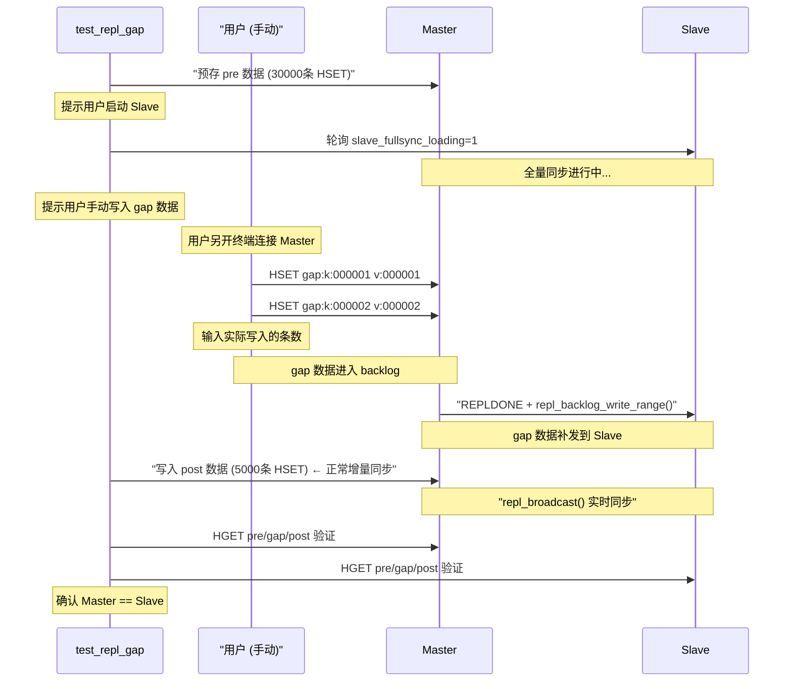

# kvstore 测试体系指南

> 从 README 迁移的完整测试教程。README 只保留摘要与 make check 一览。

# 测试体系

## 快速验证

```bash
make check        # 运行全部基础测试 (resp + ttl + persist + doc)
```

## C 测试程序 (`tests/`)

`tests/` 目录下包含独立的 C 测试程序，通过 RESP 协议连接 kvstore 进行自动化验证。

这些 C 测试程序**不依赖 hiredis 等第三方库**，直接通过 TCP socket 构造 RESP 协议报文，可在任何 Linux 环境下编译运行。

所有测试程序均支持 `--config <path>` 加载配置文件，免去每次输入冗长命令行的麻烦：

```bash
# 使用默认配置（自动加载 tests/test.conf）
./tests/test_repl_5w5w

# 或指定配置文件
./test_batch --config my_test.conf

# 命令行参数可覆盖配置文件
./test_batch --config tests/test.conf --port 6380 --count 50000
```

配置文件格式 (`tests/test.conf`):

```ini
# 通用连接
host=127.0.0.1
port=5200

# 主从复制地址
master_host=192.168.233.128
master_port=5160
slave_host=192.168.233.129
slave_port=5161

# 测试数据量
pre=50000
post=50000
count=10000

# 测试参数
batch=1000
poll_ms=500
ttl=10
```

编译方式：

```bash
# 通过 Makefile
make test_kvstore              # → ./test_kvstore
make tests/test_repl_5w5w      # → tests/test_repl_5w5w
make test_persist_dump_demo    # → ./test_persist_dump_demo
make test_persist_aof_demo     # → ./test_persist_aof_demo
make test_uring_persist        # → ./test_uring_persist
make test_mmap_recover         # → ./test_mmap_recover
make test_repl_basic           # → ./test_repl_basic
make test_repl_gap             # → ./test_repl_gap
make test_mass_ttl             # → ./test_mass_ttl
make test_batch                # → ./test_batch

# 或手动编译
gcc -I./include -o test_kvstore tests/test_kvstore.c
```

---

### `test_kvstore` — 全功能 C 客户端测试

```
编译: make test_kvstore           # → ./test_kvstore
运行: ./test_kvstore [--config tests/test.conf] [host port]
```

连接 kvstore 后依次测试 PING、各引擎 SET/GET/DEL、MSET/MGET、TTL/EXPIRE/PERSIST、
LOCK/UNLOCK/RENEW、DOC 命令、PING 批量流水线、SAVE/BGSAVE 持久化、INFO 命令，
最后输出 PASS/FAIL 汇总报告。

支持位置参数（向后兼容）和 `--config` / `--host` / `--port` 命名参数：

```bash
# 终端 1: 启动 kvstore（任意端口）
./kvstore kvstore.conf --role master

# 终端 2: 运行全功能测试（使用配置文件）
./test_kvstore --config tests/test.conf

# 或使用位置参数（向后兼容）
./test_kvstore 127.0.0.1 5160

# 或通过 Makefile 自动启动 + 测试
make check-kvstore TEST_PORT=5160
```

**验证**: 测试通过后，用 redis-cli 确认数据正确：

```bash
redis-cli -p 5160 PING
+PONG
redis-cli -p 5160 GET a:pre:1
"av:1"
redis-cli -p 5160 HGET h:pre:100
"hv:100"
redis-cli -p 5160 INFO
# 查看 role、mem、dirty 等信息
```

---

### `test_repl_5w5w` — 5w+5w 主从同步测试

```
编译: make kvstore ebpf-proxy tests/test_repl_5w5w
      # → ./kvstore、build/ebpf_proxy、tests/test_repl_5w5w
运行: tests/test_repl_5w5w [选项]
```

> ⚠️ **ebpf-proxy 必须构建（由 Master 自动拉起，无需手动启动）**：增量同步走 eBPF+tcp，依赖 `build/ebpf_proxy` 捕获 Master 客户端写入并转发给 Slave。**Master 以 `repl_realtime_transport=ebpf+tcp` 启动时会自动 spawn 独立的 ebpf-proxy 进程**（日志 `master: spawned ebpf-proxy pid=...`）。只需 `make ebpf-proxy` 构建产物，不必手动运行。若只编译 `tests/test_repl_5w5w` 而未构建 ebpf-proxy，会导致：全量同步正常，但**增量同步不进行**——Slave 侧表现为 `master_link=down`、`master_offset=0`，Phase 5 永远等不到 post 数据。

测试流程：预存 5w 条数据到 Master → 监控 Slave 全量同步(RDMA) → 再写 5w 条增量 → 监控增量同步(eBPF+tcp) → 验证 eBPF+tcp 传输状态 → 验证 Slave 最终 10w 条数据一致性。

**启动顺序（重要）**: ① Master（自动拉起 ebpf-proxy，需 root）→ ② 本脚本 → ③ Slave（看到"等待 Slave 连接"提示后再启动）

```bash


sudo killall -9 ebpf_proxy kvstore 2>/dev/null
# ── RDMA 全量 + eBPF+tcp 增量（双虚拟机，推荐，需 root）──
#
# 架构:
#   ebpf-proxy (VM1, master 自动 spawn) ──TCP──→ slave proxy listener (VM2, port+1)
#   master (VM1) ──RDMA──→ slave (VM2)
#   master (VM1) ──TCP──→ slave (VM2, 控制命令)
#
# 增量数据流: Client → master recvmsg → BPF kprobe 捕获
#   → ringbuf → ebpf-proxy → TCP → slave proxy listener (port+1)
#   → slave thread (from_replication=1) → apply + update offset

# 终端 1 (VM1, Master 机器 — 启动 Master，自动拉起 ebpf-proxy):
清理资源
sudo -S -k pkill -x kvstore
sudo -S -k pkill -x ebpf_proxy
sudo -S -k rm -rf /sys/fs/bpf/kvstore_repl_sockmap
sudo rm -rf kvstore.aof* kvstore.dump* kvstore_transport.log 
运行
sudo ./kvstore kvstore.conf --role master
# 确认 ebpf-proxy 已自动拉起: grep "spawned ebpf-proxy" /tmp/... 或 ps -ef | grep ebpf_proxy

# 终端 2 (任意机器, Master 启动后运行测试):
./tests/test_repl_5w5w --config tests/test.conf

# 终端 3 (VM2, Slave 机器 — 看到"等待 Slave 连接..."后再启动):
sudo -S -k pkill -x kvstore
sudo rm -f kvstore.dump* kvstore.aof*
sudo  ./kvstore kvstore.conf --role slave


```

选项说明：


| 选项                 | 默认值    | 说明                 |
| -------------------- | --------- | -------------------- |
| `--master-host HOST` | 127.0.0.1 | Master 地址          |
| `--master-port PORT` | 5160      | Master 端口          |
| `--slave-host HOST`  | 127.0.0.1 | Slave 地址           |
| `--slave-port PORT`  | 5161      | Slave 端口           |
| `--pre COUNT`        | 50000     | 全量同步前预存数据量 |
| `--post COUNT`       | 50000     | 全量同步后增量数据量 |
| `--batch SIZE`       | 1000      | 每批写入量           |
| `--poll MS`          | 500       | 轮询间隔毫秒         |

**eBPF+tcp 传输验证**: 测试 Phase 5.5 自动通过 `INFO` 命令检查以下字段确认 eBPF+tcp 路径是否生效：


| INFO 字段                        | 预期            | 含义                                   |
| -------------------------------- | --------------- | -------------------------------------- |
| `repl_transport_active`          | `rdma+ebpf-tcp` | 全量 RDMA + 增量 eBPF+tcp 双通道已激活 |
| `repl_broadcast_bytes`           | > 0             | master 已记账并广播增量字节            |
| `repl_transport_fallback_reason` | `none`          | 无降级，传输层正常工作                 |

> **不要用 `kprobe_initialized` 判断 eBPF+tcp**：该模式下用的是 `repl_client_capture.bpf.o`
> 的 `fexit/tcp_recvmsg`（**不是** `repl_kprobe.bpf.o`），此字段恒为 0。
> 测试程序 Phase 5.5 已按此修正，只校验 `repl_transport_active` 与 `repl_broadcast_bytes`。

**eBPF+tcp 复制会话与缓冲状态**（改造新增，用于判断「无 Slave 是否还在白干活」、
「cache 有没有积压/丢数据」、「断线后是否被正确判为不可续」）：

| INFO 字段                       | 预期              | 含义                                                     |
| ------------------------------- | ----------------- | -------------------------------------------------------- |
| `repl_session_id`               | 非 0（有 Slave）  | 当前 replication session 身份；每个新会话重新生成           |
| `repl_session_valid`            | 1                 | 会话有效；0 表示最后一个 Slave 已离开（capture 已关闭）    |
| `repl_proxy_barrier`            | 0（稳态）         | 1 表示正立着屏障：proxy 在 BUFFERING，此时不应有实时转发    |
| `ebpf_capture_enabled`          | 1                 | `client_ctl[7]`：eBPF 正在捕获                              |
| `ebpf_capture_off_count`        | 无 Slave 时增长、有 Slave 时冻结 | BPF 因 `CAPTURE_ENABLE=0` 直接返回的次数（预期行为，非错误）  |
| `repl_backlog_contiguous`       | 1                 | backlog 历史相对 `master_repl_offset` 连续（可 partial resync） |
| `repl_backlog_end_offset`       | == `master_repl_offset` | 稳态不变式；不等即存在复制历史缺口                    |
| `ebpf_proxy_cache_bytes`        | 0（稳态）         | ebpf-proxy 侧 proxy_cache 当前占用                          |
| `ebpf_proxy_cache_max_bytes`    | 小                | 峰值占用；全量同步期间应只有边界后的增量（几 KB 量级）      |
| `ebpf_proxy_cache_dropped`      | 0                 | 被作废丢弃的节点数；**增长说明发生了重新同步**              |
| `ebpf_proxy_cache_invalid`      | 0                 | 1 表示本 session 的 cache 已作废（硬上限触发）              |

**两种典型自检：**

```bash
# 无 Slave 时：capture 必须关闭、cache 不增长、backlog 标记为不连续
redis-cli -p 5160 INFO | grep -E "ebpf_capture_enabled|ebpf_capture_off_count|ebpf_proxy_cache_bytes|repl_session_valid"

# 有 Slave 且全量同步完成后：backlog_end 必须追平 master_offset
redis-cli -p 5160 INFO | grep -E "repl_backlog_(end_offset|contiguous)|master_repl_offset"
```

**kprobe+RDMA 验证** (使用 `repl_realtime_transport=kprobe-rdma` 时):


| INFO 字段               | 预期 | 含义                                    |
| ----------------------- | ---- | --------------------------------------- |
| `kprobe_initialized`    | 1    | BPF 程序已加载并 attach 到`tcp_sendmsg` |
| `kprobe_rdma_connected` | 1    | RDMA QP 已建立连接                      |
| `kprobe_rdma_writes`    | > 0  | RDMA WRITE 成功次数                     |
| `kprobe_rdma_errors`    | 0    | RDMA WRITE 错误次数                     |

**验证**: 测试通过后，确认主从数据一致：

```bash
# 在 Master 上查询
redis-cli -p 5160 HGET pre:k:000000
"v0"
redis-cli -p 5160 HGET post:k:000000
"v50000"

# 在 Slave 上查询（结果应与 Master 完全一致）
redis-cli -p 5161 HGET pre:k:000000
"v0"
redis-cli -p 5161 HGET post:k:000000
"v50000"
```

---

### `test_persist_dump_demo` — 全量持久化演示

```
编译: make test_persist_dump_demo    # → ./test_persist_dump_demo
运行: ./test_persist_dump_demo [--config tests/test.conf]
```

交互式流程：连接 kvstore → 写入 count 条数据 → 提示用户执行 `SAVE` → 提示用户停止并重启 kvstore → 自动验证数据从 dump 文件恢复。

```bash
# 终端 1: 启动 kvstore（默认 appendfsync=always 确保数据可恢复）
./kvstore kvstore.conf --role master

# 终端 2: 运行全量持久化演示
./test_persist_dump_demo --config tests/test.conf

# 程序会写入数据，然后提示你:
#   >>> Please execute SAVE in kvstore (redis-cli SAVE or nc ...)
# 在终端 1 执行 SAVE 后，程序继续提示:
#   >>> Please stop kvstore (Ctrl+C) and restart it
# 停止并重启 kvstore，程序自动检测重连并验证数据恢复
```

**验证**: SAVE 后、重启前，用 redis-cli 确认数据已持久化：

```bash
redis-cli -p 5160 SAVE
+OK
redis-cli -p 5160 HGET bench:key:1
"value:1"
redis-cli -p 5160 HGET bench:key:50000
"value:50000"
```

选项说明：


| 选项          | 默认值    | 说明         |
| ------------- | --------- | ------------ |
| `--host HOST` | 127.0.0.1 | kvstore 地址 |
| `--port PORT` | 5170      | kvstore 端口 |
| `--count N`   | 50000     | 写入数据量   |
| `--batch N`   | 1000      | 每批写入量   |

---

### `test_persist_aof_demo` — 增量持久化演示 (AOF)

```
编译: make test_persist_aof_demo     # → ./test_persist_aof_demo
运行: ./test_persist_aof_demo [选项]
```

交互式流程：连接 kvstore → 写入 count 条数据（**不执行 SAVE**）→ 提示用户停止并重启 kvstore → 自动验证数据从 AOF 文件恢复。

> **重要**: kvstore 必须使用 `--appendfsync always`，确保每条写入即时落盘。
> 使用 `--appendfsync everysec` 时，停止前需等最多 1 秒落盘，可能导致数据丢失。

```bash
# 终端 1: 启动 kvstore（默认 appendfsync=always）
./kvstore kvstore.conf --role master

# 终端 2: 运行增量持久化演示
./test_persist_aof_demo --config tests/test.conf

# 程序写入数据后提示:
#   >>> Please stop kvstore (Ctrl+C) and restart it
# 停止并重启 kvstore，程序自动验证 AOF 恢复（注意: 不执行 SAVE，数据仅靠 AOF）
```

**验证**: AOF 恢复后，确认重启前后的数据一致：

```bash
# 重启前验证
redis-cli -p 5170 HGET bench:key:1
"value:1"
redis-cli -p 5170 HGET bench:key:50000
"value:50000"

# 停止并重启 kvstore 后，再次验证（数据应仍在）
redis-cli -p 5170 HGET bench:key:1
"value:1"
redis-cli -p 5170 HGET bench:key:50000
"value:50000"
redis-cli -p 5170 PING
+PONG
```

选项说明：


| 选项          | 默认值    | 说明         |
| ------------- | --------- | ------------ |
| `--host HOST` | 127.0.0.1 | kvstore 地址 |
| `--port PORT` | 5170      | kvstore 端口 |
| `--count N`   | 50000     | 写入数据量   |
| `--batch N`   | 1000      | 每批写入量   |

---

### `test_uring_persist` — io_uring 持久化验证

```
编译: make test_uring_persist       # → ./test_uring_persist
运行: ./test_uring_persist [选项]
```

自动管理 kvstore 进程生命周期，测试 io_uring 写入路径的持久化正确性与性能。

流程：自动启动 kvstore → HSET 写入 N 条数据 → SAVE → 停止 kvstore → 重启 → 验证数据恢复 → 输出性能指标。

```bash
# 终端 1: 启动 kvstore
./kvstore kvstore.conf --role master

# 终端 2: 运行测试
./test_uring_persist --config tests/test.conf

# 程序写入数据后提示:
#   >>> 请停止 kvstore (Ctrl+C) 并重新启动 (相同参数)
# 停止并重启 kvstore，程序自动验证数据恢复
```

**验证**: 测试完成后，用 redis-cli 手动确认：

```bash
redis-cli -p 5180 HGET uring:key:1
"value:1"
redis-cli -p 5180 HGET uring:key:5000
"value:5000"
redis-cli -p 5180 HGET uring:key:10000
"value:10000"
redis-cli -p 5180 INFO | grep mem
# 查看内存后端和统计信息
```

选项说明：


| 选项          | 默认值    | 说明         |
| ------------- | --------- | ------------ |
| `--host HOST` | 127.0.0.1 | kvstore 地址 |
| `--port PORT` | 5180      | kvstore 端口 |
| `--count N`   | 10000     | 写入数据量   |
| `--batch N`   | 1000      | 每批写入量   |

---

### `test_mass_ttl` — 大量数据到期测试

```
编译: make test_mass_ttl             # → tests/test_mass_ttl
运行: tests/test_mass_ttl [选项]
```

设置 10000 个 key 并设置 10 秒过期时间，轮询抽样检查 TTL 状态，
验证 kvstore 在海量 TTL key 下的过期扫描正确性。

> **注意**: 本测试使用 `HSET`/`HEXPIRE`（HASH 引擎），因为默认 ARRAY 引擎
> (`KVS_ARRAY_SIZE=1024`) 最多只能存 1024 个 key。HASH 引擎使用链地址法，
> 无此限制。

```bash
# 终端 1: 启动 kvstore
./kvstore --port 5200 --role master

# 终端 2: 运行测试
./test_mass_ttl --port 5200 --count 10000 --ttl 10

# 终端 3: 手动检查 TTL（可选）
redis-cli -p 5200 HTTL expire:k:000000
redis-cli -p 5200 HGET expire:k:000000   # 10s 后应返回 nil
```

选项说明：


| 选项          | 默认值    | 说明         |
| ------------- | --------- | ------------ |
| `--host HOST` | 127.0.0.1 | kvstore 地址 |
| `--port PORT` | 5200      | kvstore 端口 |
| `--count N`   | 10000     | 设置 key 数  |
| `--ttl SEC`   | 10        | 过期时间(秒) |
| `--batch N`   | 1000      | 每批写入量   |

---

### `test_mmap_recover` — mmap 恢复验证

```
编译: make test_mmap_recover        # → ./test_mmap_recover
运行: ./test_mmap_recover [选项]
```

自动管理 kvstore 进程生命周期，验证启动时通过 mmap 恢复 dump 文件的正确性与性能。
支持指定存储引擎（array/hash/rbtree/skiptable）。

流程：自动启动 kvstore → 按指定引擎写入 N 条数据 → SAVE → 停止 → 重启并计时 → 从 INFO 读取恢复统计（mmap 尝试次数/成功次数/回退次数/耗时）→ 验证数据一致性。

```bash
# 终端 1: 启动 kvstore
./kvstore kvstore.conf --role master

# 终端 2: 运行测试（hash 引擎, 10000 条）
./test_mmap_recover --config tests/test.conf --engine hash

# 程序写入数据后提示:
#   >>> 请停止 kvstore (Ctrl+C) 并重新启动 (相同参数)
# 停止并重启 kvstore，程序自动验证数据恢复并显示 mmap 统计

# 使用其他引擎
./test_mmap_recover --config tests/test.conf --engine rbtree
./test_mmap_recover --config tests/test.conf --engine array
```

**验证**: 测试完成后，确认各引擎数据恢复正确：

```bash
# Hash 引擎（--engine hash）
redis-cli -p 5190 HGET mmap:key:10000
"value:10000"
redis-cli -p 5190 HGET mmap:key:1
"value:1"

# RBTREE 引擎（--engine rbtree）
redis-cli -p 5190 RGET mmap:key:5000
"value:5000"

# Skiptable 引擎（--engine skiptable）
redis-cli -p 5190 XGET mmap:key:5000
"value:5000"

# Array 引擎（--engine array，上限 1024）
redis-cli -p 5190 GET mmap:key:1024
"value:1024"
```

选项说明：


| 选项            | 默认值    | 说明                              |
| --------------- | --------- | --------------------------------- |
| `--host HOST`   | 127.0.0.1 | kvstore 地址                      |
| `--port PORT`   | 5190      | kvstore 端口                      |
| `--count N`     | 10000     | 写入数据量（array 引擎上限 1024） |
| `--engine NAME` | hash      | 引擎: array/hash/rbtree/skiptable |
| `--batch N`     | 1000      | 每批写入量                        |

---

### `test_repl_basic` — 主从复制基本验证

```
编译: make test_repl_basic          # → ./test_repl_basic
运行: ./test_repl_basic [选项]
```

用户手动管理 Master/Slave 进程，程序负责写入、监控、验证。

流程：用户启动 Master → 程序跨引擎（Hash/Array/RBTREE/Skiptable）写入 N 条数据 → 提示用户启动 Slave → 等待全量同步完成 → 再写入增量数据 → 等待增量同步 → 验证各引擎数据一致性。

```bash
# ── 单机三终端模式 ──

# 终端 1: 启动 Master（先启动）
./kvstore --port 6379 --role master \
    --repl-fullsync-transport tcp --repl-realtime-transport tcp

# 终端 2: 运行测试（Master 启动后运行）
./test_repl_basic --master-port 6379 --slave-port 6380 --count 5000

# 程序会写入数据到 Master，然后提示启动 Slave:
#   >>> 请在另一个终端启动 Slave: ...
# 此时在终端 3 启动 Slave:

# 终端 3: 启动 Slave（看到提示后再启动）
# 先清理旧数据文件，避免上次测试残留影响
rm -f kvstore.dump kvstore.aof
./kvstore --port 6380 --role slave \
    --master-host 127.0.0.1 --master-port 6379 \
    --repl-fullsync-transport tcp --repl-realtime-transport tcp


# ── 双机部署（跨机器测试）──

# 终端 1 (VM1, 先启动 Master):
./kvstore --port 6380 --role master \
    --repl-fullsync-transport tcp --repl-realtime-transport tcp

# 终端 2 (本地, Master 启动后运行):
./test_repl_basic --master-host 192.168.233.128 --master-port 6380 \
    --slave-host 192.168.233.129 --slave-port 6381 \
    --count 5000

# 终端 3 (VM2, 看到提示后再启动 Slave):
# 先清理旧数据文件，避免上次测试残留影响
rm -f kvstore.dump kvstore.aof
./kvstore --port 6381 --role slave \
    --master-host 192.168.233.128 --master-port 6380 \
    --repl-fullsync-transport tcp --repl-realtime-transport tcp
```

**验证**: 测试通过后，用 redis-cli 确认主从数据完全一致：

```bash
# 在 Master 上查询
redis-cli -p 6380 HGET h:pre:5000
"hv:5000"
redis-cli -p 6380 HGET h:pre:50
"hv:50"
redis-cli -p 6380 HGET h:post:891
"hv_post:891"
redis-cli -p 6380 HGET h:post:1232
(nil)                       # 只写了 1000 条增量(post)，1232 不存在正常
redis-cli -p 6380 GET a:pre:1
"av:1"
redis-cli -p 6380 RGET r:pre:500
"rv:500"
redis-cli -p 6380 XGET x:pre:999
"xv:999"

# 在 Slave 上查询（结果必须与 Master 完全一致）
redis-cli -p 6381 HGET h:pre:5000
"hv:5000"
redis-cli -p 6381 HGET h:pre:50
"hv:50"
redis-cli -p 6381 HGET h:post:891
"hv_post:891"
redis-cli -p 6381 GET a:pre:1
"av:1"
redis-cli -p 6381 RGET r:pre:500
"rv:500"
redis-cli -p 6381 XGET x:pre:999
"xv:999"

# 检查 Slave 只读（写操作应被拒绝）
redis-cli -p 6381 SET should_fail x
-ERR read only slave
```

两种验证方法：

- **全量同步验证**: 查询 `h:pre:*`（预存 5000 条）— 确认 Slave 有全部预存数据
- **增量同步验证**: 查询 `h:post:*`（全量完成后写入 1000 条）— 确认增量数据也同步到了 Slave
- **跨引擎验证**: 分别用 `GET`/`HGET`/`RGET`/`XGET` 确认 Array/Hash/RBTREE/Skiptable 四个引擎的数据都一致

选项说明：


| 选项                 | 默认值    | 说明            |
| -------------------- | --------- | --------------- |
| `--master-host HOST` | 127.0.0.1 | Master 地址     |
| `--slave-host HOST`  | 127.0.0.1 | Slave 地址      |
| `--master-port PORT` | 6379      | Master 端口     |
| `--slave-port PORT`  | 6380      | Slave 端口      |
| `--count N`          | 5000      | 预存/增量数据量 |
| `--batch N`          | 500       | 每批写入量      |
| `--poll MS`          | 500       | 轮询间隔毫秒    |

---

### `test_repl_gap` — 全量同步 Gap 补发验证

```
编译: make test_repl_gap          # → ./test_repl_gap
运行: ./test_repl_gap [选项]
```

验证全量同步期间客户端写入 Master 的数据（gap）在全量同步完成后正确补发到 Slave。

**测试原理**：



```bash
# ── 双机四终端测试（推荐）──

# 终端 1 (Master 机器 192.168.233.128): 先启动 Master
./kvstore kvstore.conf --role master --aof-disable

# 终端 2 (任意机器): 运行测试
./tests/test_repl_gap --config tests/test.conf

# 看到提示后，在终端 3 (Slave 机器 192.168.233.129): 启动 Slave
./kvstore kvstore.conf --role slave --aof-disable

# 看到全量同步开始提示后，在终端 4 手动写入任意 gap 数据:
redis-cli -p 5160 -h 192.168.233.128 HSET gap:mykey myvalue
# 写入完成后，回到终端 2，按 Enter 继续
```

三阶段验证确保数据不丢失：


| 阶段        | 数据                | 写入者       | 写入时机         | 同步机制               | 验证点               |
| ----------- | ------------------- | ------------ | ---------------- | ---------------------- | -------------------- |
| Phase 1     | `pre:k:001~030000`  | 测试程序     | 全量同步前       | 全量快照`+FULLRESYNC`  | Slave 有全部 pre     |
| **Phase 2** | `gap:k:001~005000`  | **用户手动** | **全量同步期间** | **backlog gap 补发**   | **Slave 有全部 gap** |
| Phase 3     | `post:k:001~005000` | 测试程序     | 全量同步后       | 实时`repl_broadcast()` | Slave 有全部 post    |

**选项说明**：


| 选项                 | 默认值    | 说明                                     |
| -------------------- | --------- | ---------------------------------------- |
| `--master-host HOST` | 127.0.0.1 | Master 地址                              |
| `--slave-host HOST`  | 127.0.0.1 | Slave 地址                               |
| `--master-port PORT` | 6379      | Master 端口                              |
| `--slave-port PORT`  | 6380      | Slave 端口                               |
| `--pre-count N`      | 30000     | 预存数据量（全量）                       |
| `--gap-count N`      | 0         | gap 数据量（全量同步期间手动写入后输入） |
| `--post-count N`     | 5000      | 增量数据量                               |
| `--batch N`          | 1000      | 每批写入量                               |
| `--poll-ms N`        | 500       | 轮询间隔毫秒                             |

---

## 全部测试目标


| 命令                                      | 数据量        | 说明                                                                                                                 | 产物路径                            |
| ----------------------------------------- | ------------- | -------------------------------------------------------------------------------------------------------------------- | ----------------------------------- |
| `make check-all`                          | 全部          | **一键运行全部测试**（自动探测 RDMA/eBPF 环境，跳过不可用项）                                                        | —                                  |
| `make check-all-quick`                    | 小+1w         | 快速全套（跳过 RDMA/eBPF/复制/10w demo）                                                                             | —                                  |
| `make check`                              | 小            | 基础功能全套                                                                                                         | —                                  |
| `make check-resp`                         | —            | RESP 协议测试                                                                                                        | —                                  |
| `make check-ttl`                          | —            | TTL 过期测试                                                                                                         | —                                  |
| `make check-persist`                      | —            | 持久化基本测试                                                                                                       | —                                  |
| `make check-doc`                          | —            | 文档对象测试                                                                                                         | —                                  |
| `make check-kvstore`                      | 小            | C 客户端综合测试（`tests/test_kvstore.c`）                                                                           | —                                  |
| `make check-bulk-1w`                      | **1w**        | 批量 1w 级全套回归（HSET/HGET/TTL/SAVE+恢复/DOC）                                                                    | —                                  |
| `make check-10w`                          | **1w~**       | 10w 级大容量功能测试                                                                                                 | —                                  |
| `make check-mass-ttl`                     | 1w            | 海量 TTL 压测                                                                                                        | —                                  |
| `make check-uring-persist`                | 1w            | io_uring 持久化验证（Python 脚本）                                                                                   | `artifacts/persist/uring-bench/`    |
| `make check-uring-persist-c`              | 1w            | io_uring 持久化验证（C 程序，自动管理进程）                                                                          | `artifacts/persist/uring-bench/`    |
| `make check-mmap-recover`                 | 1w            | mmap 恢复验证（Python 脚本）                                                                                         | `artifacts/persist/mmap-recover/`   |
| `make check-mmap-recover-c`               | 1w            | mmap 恢复验证（C 程序，支持指定引擎，自动管理进程）                                                                  | `artifacts/persist/mmap-recover/`   |
| `make check-repl`                         | 5k            | 主从复制基本验证（shell 脚本）                                                                                       | —                                  |
| `make check-repl-basic`                   | 5k            | 主从复制基本验证（C 程序，自动管理 Master/Slave 进程）                                                               | —                                  |
| `make check-repl-gap`                     | 3k+手动+1k    | 全量同步 gap 补发验证（C 程序，gap 数据由用户手动写入）                                                              | —                                  |
| `make tests/test_repl_5w5w`<br>（仅编译） | **5w+5w**     | 5w+5w 主从同步 C 测试（`tests/test_repl_5w5w.c`）<br>编译后手动运行：`tests/test_repl_5w5w --config tests/test.conf` | —                                  |
| `make check-repl-metrics`                 | 5w+5k         | 复制指标基线                                                                                                         | `artifacts/repl/metrics/`           |
| `make check-repl-profile`                 | 5w+5k         | 复制 profiling                                                                                                       | `artifacts/repl/profile/`           |
| `make check-repl-ebpf`                    | 5w+5k         | eBPF 实时同步 profiling                                                                                              | `artifacts/repl/profile/`           |
| `make check-repl-ebpf-env`                | —            | eBPF 环境探测                                                                                                        | —                                  |
| `make check-repl-ebpf-sync`               | 64            | eBPF sockmap 同步验证                                                                                                | `artifacts/repl/ebpf-sync/`         |
| `make check-repl-ebpf-sync-required`      | 64            | eBPF 同步验证（要求 eBPF 可用）                                                                                      | `artifacts/repl/ebpf-sync/`         |
| `make check-repl-ebpf-redirect`           | 64            | eBPF ingress 重定向验证                                                                                              | `artifacts/repl/ebpf-sync/`         |
| `make check-repl-rdma-unsupported`        | 小            | RDMA 不可用时的优雅降级测试                                                                                          | —                                  |
| `make check-repl-rdma-smoke`              | 小            | RDMA 冒烟测试                                                                                                        | `artifacts/repl/rdma-smoke/`        |
| `make check-repl-rdma-stress`             | 中            | RDMA 压力测试（重启轮次 + 尾写验证）                                                                                 | `artifacts/repl/rdma-stress/`       |
| `make check-repl-rdma-soak`               | 中            | RDMA 长时浸泡（可配小时级）                                                                                          | `artifacts/repl/rdma-stress/`       |
| `make check-repl-rdma-long-soak`          | 中            | RDMA 超长浸泡（默认 1800s）                                                                                          | `artifacts/repl/rdma-stress/`       |
| `make check-repl-rdma-fallback`           | 小            | RDMA 强制降级到 TCP 验证                                                                                             | —                                  |
| `make check-demo-full-dump`               | **10w**       | 全量持久化演示                                                                                                       | `artifacts/persist/full-dump-demo/` |
| `make check-demo-incr-aof`                | **10w**       | 增量持久化演示                                                                                                       | `artifacts/persist/incr-aof-demo/`  |
| `make check-demo-repl-sync`               | **5w+5w=10w** | 主从同步演示（可配 RDMA+eBPF 混合传输）                                                                              | `artifacts/repl/sync-demo/`         |
| `make check-rdma-standalone-probe`        | —            | RDMA 环境探测                                                                                                        | `artifacts/rdma/probe/`             |
| `make check-rdma-pingpong-smoke`          | —            | RDMA pingpong 测试                                                                                                   | `artifacts/rdma/pingpong/`          |

> **注意**：若之前使用 `sudo make check-demo-repl-sync` 运行过，`artifacts/repl/sync-demo/` 下的文件属主为 root，再次运行时需先 `sudo rm -rf artifacts/repl/sync-demo` 清理，否则会报 `PermissionError`。

## 辅助测试脚本（非 Makefile 目标）

以下脚本位于 `tools/` 目录下，可直接运行，未绑定 Makefile 目标：


| 脚本                                   | 位置             | 说明                                         |
| -------------------------------------- | ---------------- | -------------------------------------------- |
| `test_master_slave_multi_engine_nc.sh` | `tools/tests/`   | 多引擎主从复制 nc 测试（手动指定 host/port） |
| `test_kv.sh`                           | `tools/tests/`   | kvstore 基本功能测试                         |
| `run_save_bgsave_perf_test.sh`         | `tools/persist/` | SAVE/BGSAVE 性能测试                         |
| `repl_ebpf_session.py`                 | `tools/repl/`    | eBPF 复制会话管理（交互式调试）              |
| `run_repl_rdma_unsupported.py`         | `tools/repl/`    | RDMA 不可用场景模拟测试                      |
| `repl_ebpf_daemon.c`                   | `tools/ebpf/`    | eBPF 独立守护进程（需编译）                  |

示例：

```bash
# 多引擎主从测试
bash tools/tests/test_master_slave_multi_engine_nc.sh 127.0.0.1 5160

# SAVE/BGSAVE 性能测试
bash tools/persist/run_save_bgsave_perf_test.sh
```

## 参数化运行

```bash
# 指定端口
make check TEST_PORT=5160

# 主从复制自定义端口
make check-repl REPL_MASTER_PORT=7000 REPL_SLAVE_PORT=7001

# 10w 级测试自定义数据量
make check-10w CHECK_10W_COUNT=50000

# 海量 TTL 自定义规模
make check-mass-ttl MASS_TTL_KEYS=5000 MASS_TTL_SECONDS=2

# io_uring 持久化自定义参数
make check-uring-persist URING_PERSIST_COUNT=5000 URING_PERSIST_APPEND_FSYNC=everysec

# mmap 恢复指定引擎
make check-mmap-recover MMAP_RECOVER_ENGINE=hash MMAP_RECOVER_COUNT=20000

# 批量 1w 级回归自定义规模
make check-bulk-1w BULK_COUNT=50000

# eBPF 同步测试
make check-repl-ebpf-sync REPL_EBPF_SYNC_COUNT=128

# RDMA 压力测试自定义参数
make check-repl-rdma-stress REPL_RDMA_STRESS_PRELOAD=256 REPL_RDMA_STRESS_TAIL_WRITES=64 REPL_RDMA_STRESS_RESTART_ROUNDS=5

# RDMA 浸泡测试自定义时长
make check-repl-rdma-soak REPL_RDMA_SOAK_SECONDS=300 REPL_RDMA_SOAK_WRITE_INTERVAL_MS=100

# RDMA 长浸泡（30 分钟）
make check-repl-rdma-long-soak

# RDMA 可调参数测试（recv slots / chunk size / QP depth）
make check-repl-rdma-stress REPL_RDMA_TUNABLE_RECV_SLOTS=64 REPL_RDMA_TUNABLE_CHUNK_SIZE=65536 REPL_RDMA_TUNABLE_QP_WR_DEPTH=128

# RDMA 强制降级验证
make check-repl-rdma-fallback REPL_RDMA_FORCE_FALLBACK=1

# 全量同步演示自定义传输方式
make check-demo-repl-sync REPL_SYNC_DEMO_FULLSYNC=rdma REPL_SYNC_DEMO_REALTIME=ebpf

# 一键运行全部测试
make check-all

# 快速全套（跳过 RDMA/eBPF/复制/demo）
make check-all-quick

# 只跑特定目标
python3 tools/tests/run_all_tests.py --only check,check-bulk-1w,check-mass-ttl
```
